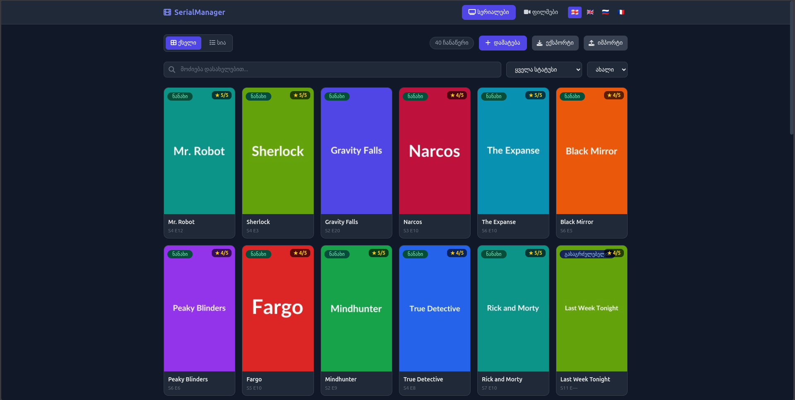

# SerialManager

[🇬🇪 ქართული](README.md) · [🇬🇧 English](README.en.md) · [🇷🇺 Русский](README.ru.md) · [🇫🇷 Français](README.fr.md)

Application web pour gérer les séries et les films. PHP + SQLite + Tailwind CSS.



## Prérequis

- PHP 8.1 ou plus récent
- Extension `mbstring` (incluse dans PHP)
- Paquet `php-sqlite3`

```
sudo apt install php-sqlite3 php-mbstring
```

## Lancement

### Avec le routeur (recommandé)

```sh
php -S localhost:8002 -t serial2 serial2/router.php
```

### Sans le routeur

```sh
php -S localhost:8002 -t serial2
```

Le routeur gère le service des fichiers statiques (JS, CSS, images).

### Changer le port

Remplacez `8002` par n'importe quel port disponible.

## Fonctionnalités

### Principales
- Ajouter / Modifier / Supprimer des séries et des films
- Deux modes d'affichage : grille et liste
- Recherche en direct (Unicode insensible à la casse, debounce 300ms)
- Filtre par statut
- Tri : par date (récent/ancien) et par ordre alphabétique (A–Z / Z–A)

### Couvertures
- Téléchargement depuis une URL externe et stockage local
- Badge : ✓ Local / ✗ Online
- Plus de 100 couvertures déjà téléchargées

### Statut automatique
- Les deux champs remplis (saison + épisode) → `ნანახი` (Visionné)
- Un seul champ rempli → `გასაგრძელებელია` (En cours)
- Les deux vides → `სანახავია` (À voir)
- Saison > 99 → efface les deux champs, statut → `სანახავია`

### Import / Export
- Export SQL (un seul fichier pour les deux tables)
- Import SQL (.sql, max 10MB, protégé CSRF)
- L'import filtre les colonnes pour correspondre au schéma existant (compatible)

### Interface
- 4 langues : 🇬🇪 Géorgien, 🇬🇧 Anglais, 🇷🇺 Russe, 🇫🇷 Français
- Thème sombre (Tailwind CSS + Font Awesome 6)
- Adaptatif : tableau sur desktop, cartes sur mobile
- Protection CSRF (requêtes POST)
- Suppression avec minuteur de 5 secondes

## Structure des fichiers

```
serial2/
├── config.php          # DB, i18n, CSRF, import/export
├── index.php           # Routage, CRUD, gestionnaires AJAX
├── router.php          # Routeur de fichiers statiques
├── data.sqlite         # Base de données SQLite
├── views/
│   └── layout.php      # Mise en page HTML (Tailwind)
├── public/
│   └── js/
│       └── app.js      # Logique frontend
├── lang/
│   ├── ka.php          # Géorgien
│   ├── en.php          # Anglais
│   ├── ru.php          # Russe
│   └── fr.php          # Français
└── uploads/
    └── covers/          # Images de couverture locales
```

## Base de données

- Fichier : `data.sqlite`
- Tables : `series` et `movies`
- Auto-migration : les colonnes manquantes sont ajoutées automatiquement

### series
| Colonne | Type | Description |
|---|---|---|
| id | INTEGER | Clé primaire |
| cover | TEXT | Chemin/URL de la couverture |
| title | TEXT | Titre |
| season | INTEGER | Saison |
| episode | INTEGER | Épisode |
| status | TEXT | Statut |
| rating | INTEGER | Note (0–5) |
| resource_url | TEXT | Lien vers la ressource |

### movies
| Colonne | Type | Description |
|---|---|---|
| id | INTEGER | Clé primaire |
| cover | TEXT | Chemin/URL de la couverture |
| title | TEXT | Titre |
| description | TEXT | Description |
| status | TEXT | Statut |
| rating | INTEGER | Note (0–5) |
| resource_url | TEXT | Lien vers la ressource |

## Récupération

Si `data.sqlite` est manquant (ou au premier lancement), l'application propose :
1. **Créer une base vide** — migration automatique
2. **Importer un fichier SQL** — restauration depuis une sauvegarde
3. **Annuler**

Pour créer une sauvegarde SQL : cliquez sur le bouton `Export` dans la barre d'outils.

## Sécurité

- Jeton CSRF sur toutes les requêtes POST
- Protection contre les injections SQL : requêtes préparées
- Protection XSS : `htmlspecialchars()` sur toutes les sorties
- Import de fichiers : uniquement `.sql`, max 10MB

## Licence

MIT
